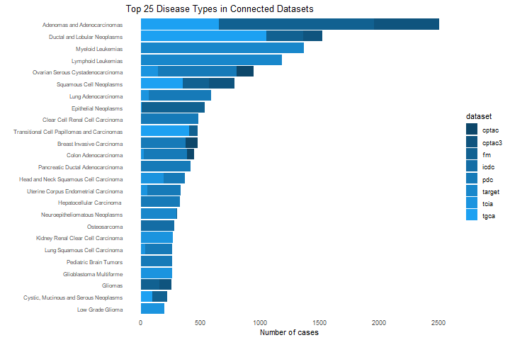
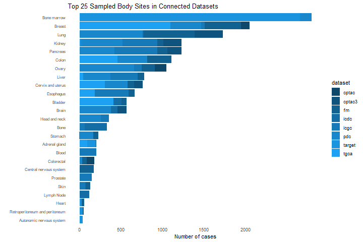
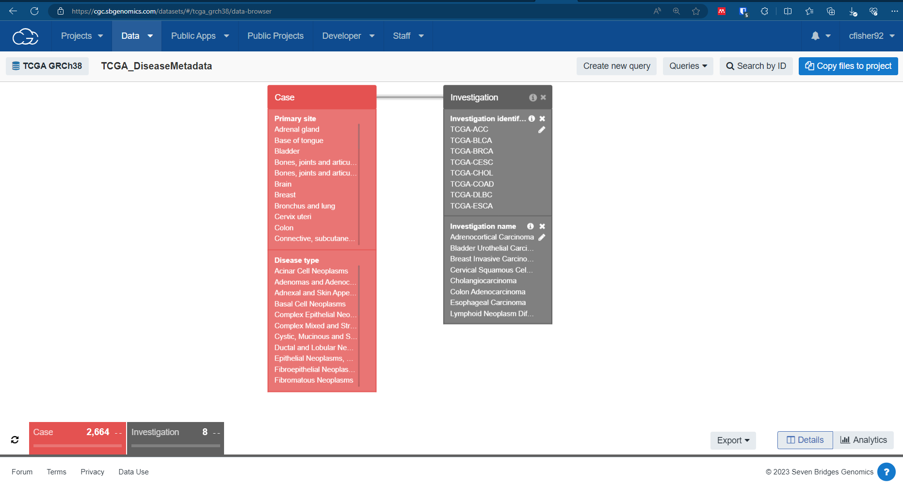

```{r setup, include=FALSE}
knitr::opts_chunk$set(echo = TRUE)
```

# Making visualizations of hosted datasets

The biggest difficulty with summarizing the data in the CGC's connected datasets is the difficulty that always exists with making summaries over disparate datasets: the datasets are not harmonized and do not use the same metadata. 

We have to make do with what we've got. 




Here, I'm trying to get a representation of data volume that will both be useful to scientists and will also be reproducible as we ingest more metadata. It seems to me that the things most useful to researchers who are trying to use our hosted data are [Fig1] Disease Type (what kind of cancer is this data about?) and [Fig2] Primary Sites (what part of the body did the sample come from?).


One stumbling block is that TCIA, which is imaging data, doesn't have primary site recorded, while ICGC, which is all molecular data, doesn't have disease type recorded. Oh well, let's do the best we can; we'll make two charts, one with primary site and one with disease type, and we'll just have a blank for TCIA/ICGC in either of those charts. 

### Part 1 - Import and Aggregate Data

```{r message=FALSE, warning=FALSE}
library(tidyverse)
library(ggplot2)
```

#### Where did the data tables come from? 

For seven of our connected data sources, the metadata were accessed by using Data Browser on the CGC. These sources are: CPTAC, CPTAC3, FM, ICGC, TARGET, TCIA, and TCGA. To reproduce these searches and re-pull the metadata, you must affirmatively select all the options in the given metadata key you want to pull, and use the 'Export' option at the bottom right of the screen to export to TSV. For example for TCGA, use Data Browser and affirmatively select every available 'Primary Site' and 'Disease Type' (Figure 3 below)



#### What are the data sources represented here? 


*CPTAC* and *CPTAC-3* - the Clinical Proteomic Tumor Analysis Consortium. Data consists of genomics and proteomics. 

*FM* - Foundation Medicine Adult Cancer Clinical Dataset. 

*ICDC* - Integrated Canine Data Commons

*ICGC* - International Cancer Genome Consortium

*PDC* - Proteomic Data Commons 

*TARGET* - Therapeutically Applicable Research to Generate Effective Treatments

*TCGA* - The Cancer Genome Atlas 

Not currently included, but to be incorporated: 

*Cancer Data Services* datasets -- not included because of difficulties in collapsing the disease types categories in those datasets with the disease types present in these larger sources. Generally issues of much higher specificity in the CDS datasets; for example, one disease type from MCI is "Pilocytic Astrocytoma Kiaa1549::Braf Fusion-Positive (Who Grade 1)".

*Genomic Data Commons* -- not included because the GENIE dataset of over 40,000 cases so badly swamps everything else; the graph ends up being a GENIE graph rather than showing all of the other datasets. 

*TCIA* - The Cancer Imaging Archive -- not included because there is no field in the TCIA data analogous to "disease type". 


#### Import metadata files 

These metadata files were created by using Data Browser. 

```{r}
filesdir = "../data/"


# This parse tables function doesn't do much besides make a dataframe and add
# the dataset name

parseTables <- function(tsv, name) {
   df <- read.table(tsv, header=TRUE, sep = "\t")
   df <- df %>% mutate(dataset = name)
   return(df)
}

# Read in the datasets' metadata 

cptac.file <- paste(filesdir, "cptac_20230815_0.tsv", sep="")
cptac3.file <- paste(filesdir, "cptac_3_20230815_0.tsv", sep="")
tcga.file <- paste(filesdir, "tcga_grch38_20230815_0.tsv", sep="")
tcia.file <- paste(filesdir, "tcia_20230815_0.tsv", sep="")
target.file <- paste(filesdir, "target_20230815_0.tsv", sep="")
fm.file <- paste(filesdir, "fm_20230815_0.tsv", sep="")
icgc.file <- paste(filesdir, "icgc_20230815_0.tsv", sep="")


cptac.df <- parseTables(cptac.file, "cptac")
cptac3.df <- parseTables(cptac3.file, "cptac3")
tcga.df <- parseTables(tcga.file, "tgca")
fm.df <- parseTables(fm.file, "fm")
tcia.df <- parseTables(tcia.file, "tcia")
target.df <- parseTables(target.file, "target")
icgc.df <- parseTables(icgc.file, "icgc")

```

Now we've got these datasets, we've got to harmonize their column names. 

```{r}

colnames(cptac.df)
colnames(tcia.df)
colnames(icgc.df)

# let's just keep the caseid/donor, primary site, and disease type. And rename them as we go. 

cptac.df <- cptac.df %>% select(case, disease_type = case_diseasetype_1, primary_site = case_primarysite_1, dataset)
cptac3.df <- cptac3.df %>% select(case, disease_type = case_diseasetype_1, primary_site = case_primarysite_1, dataset)
fm.df <- fm.df %>% select(case, disease_type=case_diseasetype_1, primary_site=case_primarysite, dataset)
icgc.df <- icgc.df %>% mutate(disease_type=NA) %>% select(case=donor, disease_type, primary_site=donor_primarysite_1, dataset)
target.df <- target.df %>% select(case, disease_type = case_diseasetype_1, primary_site=case_primarysite_1, dataset)
tcga.df <- tcga.df %>% select(case, disease_type=case_diseasetype_1, primary_site=case_primarysite_1, dataset)
tcia.df <- tcia.df %>% mutate(primary_site=NA) %>% select(case, disease_type=case_diseasetype_1, primary_site, dataset)
```

Now they all have the same column names in the same order. We can row bind them, which we'll do after importing PDC and ICDC.  

#### Add Proteomic Data Commons 

Metadata from PDC and ICDC were downloaded from their respective data repositories. Both of them permit download of metadata as a manifest; in the case of PDC, the "biospecimens" table was downloaded from https://proteomic.datacommons.cancer.gov/pdc/browse.  

```{r}
pdc.file <- paste(filesdir, "PDC_metadata_082223.txt", sep="")
pdc.df <- parseTables(pdc.file, "pdc")
colnames(pdc.df)

pdc.df <- pdc.df %>%
  select(case=Case.ID, disease_type=Disease.Type, primary_site=Primary.Site, dataset)
```

#### Canine data commons

In the case of the ICDC, the "Cases" table was downloaded from https://caninecommons.cancer.gov/#/explore - Select the "Cases" tab, look for the icon of a cloud with an arrow in it right above the right hand side of the table, and click it to "Download table contents as csv".

Extensive manual data sanitizing was done for ICDC, due to capitalization issues and comma insertions. 

```{r}
icdc.file <- paste(filesdir, "ICDC_Cases_082223_metadata_sanitized.txt", sep="")
icdc.df <- parseTables(icdc.file, "icdc")

icdc.df <- icdc.df %>% select(case=Case.ID, disease_type=Diagnosis, primary_site=Disease.Site, dataset) %>%
  unique()

## there are 678 unique cases, which matches what is on the website. 

```

#### Bind the small dataframes into a large one


```{r}

datasets.df <- bind_rows(cptac.df, cptac3.df, fm.df, icgc.df, target.df, tcga.df, tcia.df, pdc.df, icdc.df)
dim(datasets.df)


```


#### Count the disease types and determine the top twenty

We want two things -- we want to count the disease types in each dataset, and we also want the top disease types over all. 

```{r}

disease_types <- datasets.df %>% group_by(dataset) %>% count(disease_type) %>% arrange(desc(n)) %>% ungroup()
# Get rid of OTHER and NOS
disease_types <- disease_types %>% filter(!(disease_type == "Other"))
disease_types$disease_type <- gsub(", NOS", "", disease_types$disease_type, ignore.case = TRUE)
disease_types$disease_type <- gsub("Pediatric/AYA Brain Tumors", "Pediatric Brain Tumors", disease_types$disease_type)
write.table(disease_types, "../out/datasets_disease_types.txt", sep="\t", row.names = FALSE, quote = FALSE, eol="\n")

datasets_disease <- disease_types
top_diseases <- datasets_disease %>% group_by(disease_type) %>% summarize(n=sum(n)) %>% arrange(desc(n))
top_25 <- top_diseases %>% filter(!(is.na(disease_type))) %>% slice_head(n=25)

knitr::kable(top_25, caption="The top 25 disease types in our hosted data regardless of source", format = 'markdown')

```

This is a nice table, but we want it in a plot. 

### Part 2 - Create the dataframe for plotting and make the chart

```{r}

# Let's collect these categories of disease_types from the dataset-grouped list, 
# but add the Level information to it from top_25$disease_type so we 
# can use that for making Factors. 
disease_plot_data <- datasets_disease %>% filter(disease_type %in% top_25$disease_type) %>%
   mutate(level = match(disease_type, top_25$disease_type))

 disease_plot_data <- disease_plot_data %>% arrange(by=level)
 
 disease_plot_data$disease_type <- factor(disease_plot_data$disease_type, unique(disease_plot_data$disease_type))
 levels(disease_plot_data$disease_type)

disease_plot <- ggplot(disease_plot_data, aes(x=disease_type, y=n, group=dataset)) +
  theme_minimal() +
  geom_col(position="stack", aes(fill=dataset)) + 
  coord_flip() + 
  scale_x_discrete(limits=rev(levels(disease_plot_data$disease_type))) +
  theme(panel.grid = element_blank(),
        axis.text.y=element_text(size=8)) +
  labs(x="", y="Number of cases", title="Top 25 Disease Types in Connected Datasets")

palette_cgc8 <- c("#1da1f2", "#1b94df", "#1887cb", "#167ab8", "#146da5", "#116191", "#0f547e", "#0d476a")

disease_plot +
  scale_color_manual(values=rev(palette_cgc8), aesthetics = c("color", "fill"))

# png(filename = "../out/Top25DiseaseTypesInConnectedData.png", width = 720)
# disease_plot +
#   scale_color_manual(values=rev(palette_cgc8), aesthetics = c("color", "fill"))
# dev.off()
# 
# pdf(file="../out/Top25DiseaseTypesInConnectedData.pdf")
# disease_plot +
#   scale_color_manual(values=rev(palette_cgc8), aesthetics = c("color", "fill"))
# dev.off()
# 
# disease_plot +
#   scale_color_manual(values=rev(palette_cgc9), aesthetics = c("color", "fill"))
# dev.off()

```

The below block was used to make higher resolution version with bigger fonts and capitalize the datasets -- this is the website version. I don't evaluate this code in this notebook because it will look terrible in a markdown doc. 


```{r eval=FALSE}

disease_plot_data <- disease_plot_data %>% mutate(dataset = toupper(dataset))

disease_plot <- ggplot(disease_plot_data, aes(x=disease_type, y=n, group=dataset)) +
  theme_minimal() +
  geom_col(position="stack", aes(fill=dataset)) + 
  coord_flip() + 
  scale_x_discrete(limits=rev(levels(disease_plot_data$disease_type))) +
  theme(panel.grid = element_blank(),
        axis.text.y=element_text(size=28),
        plot.title=element_text(size=34, hjust = 0),
        legend.key.size=unit(1.5, 'cm'),
        legend.text=element_text(size=22),
        legend.title=element_blank(),
        axis.text.x=element_text(size=24),
        axis.title.x=element_text(size=24)) +
  labs(x="", y="Number of cases", title="Top disease types in the connected CRDC datasets")

disease_plot +
  scale_color_manual(values=rev(palette_cgc8), aesthetics = c("color", "fill"))
# 
# png(filename = "out/Top25DiseaseTypesInConnectedData_ForWeb.png", width = 2160, height = 1440 )
# disease_plot +
#   scale_color_manual(values=rev(palette_cgc8), aesthetics = c("color", "fill"))
# dev.off()

# svg(filename="out/Top25DiseaseTypes_forWeb.svg", width=720)
# disease_plot_svg +
#   scale_color_manual(values=rev(palette_cgc8), aesthetics = c("color", "fill"))
# dev.off()

```


# Primary Site 

We start from our same datasets.df, but to make things a little more manageable, I am doing some synonymizing over these anatomical sites. 

```{r}

datasets.df$primary_site <- gsub("Liver and intrahepatic bile ducts", "Liver", datasets.df$primary_site)
# and just let's remove the "NOS" after Uterus
datasets.df$primary_site <- gsub(", NOS", "", datasets.df$primary_site)

datasets.df$primary_site <- gsub("Hematopoietic and reticuloendothelial systems", "Bone marrow", datasets.df$primary_site)
datasets.df$primary_site <- gsub("Spinal cord, cranial nerves, and other parts of central nervous system", "Central nervous system", datasets.df$primary_site)
datasets.df$primary_site <- gsub("Bronchus and lung", "Lung", datasets.df$primary_site)
datasets.df$primary_site <- gsub("Cervix uteri", "Cervix and uterus", datasets.df$primary_site)
datasets.df$primary_site <- gsub("Uterus", "Cervix and uterus", datasets.df$primary_site)
datasets.df$primary_site <- gsub("Head and Neck", "Head and neck", datasets.df$primary_site)
datasets.df$primary_site <- gsub("Rectum", "Colorectal", datasets.df$primary_site)
datasets.df$primary_site <- gsub("Peripheral nerves and autonomic nervous system", "Autonomic nervous system", datasets.df$primary_site)
datasets.df$primary_site <- gsub("Heart, mediastinum, and pleura", "Heart", datasets.df$primary_site)


top_primary_sites <- datasets.df %>%
  count(primary_site) %>%
  arrange(desc(n)) %>%
  filter(!is.na(primary_site))


top_25_ps <- datasets.df %>%
  count(primary_site) %>%
  arrange(desc(n)) %>%
  filter(!is.na(primary_site)) %>%
  filter(!(primary_site == "Other and ill-defined sites"),
         !(primary_site == "Unknown"), 
         !(primary_site == "Not Reported")) %>%
  slice_head(n=25)
  


knitr::kable(top_25_ps, caption="Primary sites ranked by number of cases, regardless of source")

```

Now we'll break them out by dataset:

```{r}
primary_sites_datasets <- datasets.df %>% 
  filter(!(is.na(primary_site)),
         !(primary_site == "Other and ill-defined sites"),
         !(primary_site == "Unknown"), 
         !(primary_site == "Not reported")) %>%
  group_by(dataset) %>% 
  count(primary_site) %>% 
  arrange(desc(n)) 


```

Alright. Now we just have to repeat what we did to get the top 25 and factor them correctly

```{r}

prsite_plot_data <- primary_sites_datasets %>% filter(primary_site %in% top_25_ps$primary_site) %>%
  mutate(level=match(primary_site, top_25_ps$primary_site))


prsite_plot_data <- prsite_plot_data %>% arrange(by=level)
prsite_plot_data$primary_site <- factor(prsite_plot_data$primary_site, unique(prsite_plot_data$primary_site))

levels(prsite_plot_data$primary_site)

```

And make the plot with the colors:

```{r}

site_plot <- ggplot(prsite_plot_data, aes(x=primary_site, y=n, group=dataset)) +
  theme_minimal() +
  geom_col(position="stack", aes(fill=dataset)) + 
  coord_flip() + 
  scale_x_discrete(limits=rev(levels(prsite_plot_data$primary_site))) +
  scale_y_continuous(breaks=c(0, 500, 1000, 1500, 2000, 3000)) +
  # scale_x_discrete(limits=rev(levels(disease_plot_data$disease_type)), labels = function(x) str_wrap(x, width=40)) +
  theme(panel.grid = element_blank(),
        axis.text.y=element_text(size=8)) +
  labs(x="", y="Number of cases", title="Top 25 Sampled Body Sites in Connected Datasets")
  


site_plot + 
  scale_color_manual(values=rev(palette_cgc8), aesthetics = c("color", "fill"))
```
##### Save Rdata and print session info 

```{r}
save.image(file="SummarizeConnectedDatasets.RData")
sessionInfo()
```

